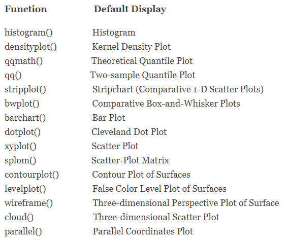

```{r setup, include=FALSE, warning=FALSE}
knitr::opts_chunk$set(echo = TRUE)

suppressWarnings(library(magrittr))
suppressWarnings(library(dplyr))
suppressWarnings(library(readxl))
suppressWarnings(library(tidyr))
suppressWarnings(library(DT))
suppressWarnings(library(kableExtra))
suppressWarnings(library(formattable))
suppressWarnings(library(knitr))
suppressWarnings(library(kableExtra))
suppressWarnings(library(rpivotTable))
suppressWarnings(library(gt))
suppressWarnings(library(reactable))
suppressWarnings(library(flextable))
suppressWarnings(library(lattice))
suppressWarnings(library(ggplot2))
suppressWarnings(library(hrbrthemes))
library(viridis)


setwd("C:/Users/oscar/Desktop/R --- SAF/Tema 5")

data <- read_excel("data.xlsx")
```


<style>
table {
background-color:#FFFFFF;
}
</style>

<style>
.list-group-item.active, .list-group-item.active:focus, .list-group-item.active:hover {
    background-color: darkblue;
}
</style>

<button onclick="document.body.scrollTop = document.documentElement.scrollTop = 0;" style="
    position: fixed;
    bottom: 5px;
    right: 40px;
    text-align: center;
    cursor: pointer;
    outline: none;
    color: #fff;
    background-color: #0A71A0;
    border: none;
    border-radius: 15px;
    
">Ir arriba</button>

# {.tabset .tabset-fade .tabset-pills}

El presente tema expone la representación visual mediantes gráficos, nube de palabras y otros elementos. Se abordarán los puntos:

- ¿Cuál método visual utilizar?
- Visualización clásica.
- ggplot.
- Plotly.
- sunburstR
- highcharter
- Otras librerías en R....

Al finalizar la sesión podrá conocer los principales **paquetes** - *librerías* de visualización de la información en R.


## Formas de visualizar {.tabset .tabset-fade .tabset-pills}


Existen muchas, muchíiiiiiiisimas formas para visualizar la información. ¿Qué deberíamos elegir? Esto depende de lo que queramos hacer.

- Barras verticales / horizontales.
- Histogramas.
- Lineas.
- Áreas.
- Disperción.
- Circular.
- Anillos o donas.
- Proyección solar.
- Bloques.
- Radar.
- Mapas.
- Nube de palabras.
- etc...

Y la lista podría seguir...

Al analizar datos nos hacemos la pregunta: ¿qué debería utlizar para visualr esta información?

Acá les presento una guía resumida:

 

¿Y para visual el texto que utilizamos?

Trataremos de cubrir esta pregunta más adelante, sin embargo adentarse en el mundo de la visualización es descubrir que existe una gama mucho más amplia, versatil e interesante a la hora de visualizar nuestra data. 


##  Clásico {.tabset .tabset-fade .tabset-pills}


## lattice {.tabset .tabset-fade .tabset-pills}


El paquete latice fue la primera evolución en la mejora visual de los datos. Dentro de los principales gráficos se pueden realizar:


Las funciones utilizadas para poder desarrollar dichos gráficos son las siguientes:



Veamos algunos ejemplos


```{r echo=FALSE, warning=TRUE}
attach(mtcars)
gear.f<-factor(gear,levels=c(3,4,5),
   labels=c("3gears","4gears","5gears"))
cyl.f <-factor(cyl,levels=c(4,6,8),
   labels=c("4cyl","6cyl","8cyl"))
```

#### Gráfico de densidad

```{r warning=FALSE}

densityplot(~mpg,
   main="Density Plot",
   xlab="Miles per Gallon")
```


#### Gráfico de densidad por grupo


```{r warning=FALSE}
densityplot(~mpg|cyl.f,
   main="Density Plot by Number of Cylinders",
   xlab="Miles per Gallon")
```


#### Agrupación apilada 

```{r warning=FALSE}
densityplot(~mpg|cyl.f,
   main="Density Plot by Numer of Cylinders",
   xlab="Miles per Gallon",
   layout=c(1,3))
```

#### Disperción según factores

```{r warning=FALSE}
xyplot(mpg~wt|cyl.f*gear.f,
   main="Scatterplots by Cylinders and Gears",
   ylab="Miles per Gallon", xlab="Car Weight")
```

#### Dispersión 3D

```{r warning=FALSE}
cloud(mpg~wt*qsec|cyl.f,
   main="3D Scatterplot by Cylinders")
```

#### Correlograma de las variables

```{r warning=FALSE}
splom(mtcars[c(1,3,4,5,6)],
   main="MTCARS Data")
```

Pues, es mucho más atractivo que los gráficos "clásicos", sin embargo el paquete **ggplot** trajo una mejora considerable a lo que la visualización de la información respecta.

---------------------------------------------------------------------------------------------------------------------------------------------------


## ggplot2 {.tabset .tabset-fade .tabset-pills}


## ggchart {.tabset .tabset-fade .tabset-pills}

 


## Plotly {.tabset .tabset-fade .tabset-pills}


## dygraph {.tabset .tabset-fade .tabset-pills}


## sunburstR {.tabset .tabset-fade .tabset-pills}


## highcharter {.tabset .tabset-fade .tabset-pills}


## REF {.tabset .tabset-fade .tabset-pills}


Véase los siguientes sitios de referencia 

### lattice

https://www.statmethods.net/advgraphs/trellis.html
http://www.sthda.com/english/wiki/lattice-graphs
http://www.sthda.com/english/wiki/lattice-graphs
https://www.rdocumentation.org/packages/lattice/versions/0.20-41
https://www.dummies.com/programming/r/how-to-create-a-lattice-plot-in-r/
https://data-flair.training/blogs/r-lattice-package/
https://stat.ethz.ch/R-manual/R-devel/library/lattice/html/Lattice.html
http://www.datavis.ca/courses/RGraphics/R-Graphics3.pdf

### ggplot2

https://www.r-graph-gallery.com/ggplot2-package.html
http://r-statistics.co/ggplot2-Tutorial-With-R.html
https://ggplot2.tidyverse.org/
https://www.statmethods.net/advgraphs/ggplot2.html
https://rpubs.com/daniballari/ggplot
http://tutorials.iq.harvard.edu/R/Rgraphics/Rgraphics.html
https://www.rdocumentation.org/packages/ggplot2/versions/3.3.2
https://swcarpentry.github.io/r-novice-gapminder-es/08-plot-ggplot2/
https://datacarpentry.org/R-ecology-lesson/04-visualization-ggplot2.html


### ggchart

https://github.com/thomas-neitmann/ggcharts
https://www.rdocumentation.org/packages/ggcharts/versions/0.2.1
https://rdrr.io/cran/ggcharts/
https://tereom.github.io/tutoriales/R_intro_visualizacion.html

### Plotly

https://plotly.com/r/
https://plotly-r.com/
https://www.rdocumentation.org/packages/plotly/versions/4.9.2.1
https://www.neonscience.org/plotly
https://www.it-swarm.dev/es/r-plotly/
https://github.com/ropensci/plotly
https://rdrr.io/cran/plotly/man/ggplotly.html
https://www.htmlwidgets.org/showcase_plotly.html
https://www.r-bloggers.com/introduction-to-interactive-graphics-in-r-with-plotly/

### dygraph

https://rstudio.github.io/dygraphs/
https://www.htmlwidgets.org/showcase_dygraphs.html
https://github.com/rstudio/dygraphs
https://blog.rstudio.com/2015/04/14/interactive-time-series-with-dygraphs/
https://rdrr.io/cran/dygraphs/man/dySeries.html
https://rpubs.com/Da_As_Kumi/561455
https://bookdown.org/kochiuyu/Technical-Analysis-with-R/dygraphs-package.html
http://www.imsbio.co.jp/RGM/R_function_list?package=dygraphs&init=true
https://www.r-bloggers.com/how-to-plot-with-dygraphs-exercises/

### sunburstR

http://rstudio-pubs-static.s3.amazonaws.com/495237_5336f47cb4df483f8f2780cd92066449.html
https://www.data-to-viz.com/graph/sunburst.html
https://github.com/timelyportfolio/sunburstR
https://www.rdocumentation.org/packages/sunburstR/versions/2.1.3/topics/sunburst
https://rdrr.io/cran/sunburstR/src/R/sunburst.R


### highcharter

https://rstudio-pubs-static.s3.amazonaws.com/320413_6ab300527e8548b1a3cbd0d4c6200fcc.html
https://www.highcharts.com/blog/tutorials/highcharts-for-r-users/
https://towardsdatascience.com/exploring-highcharts-in-r-f754143efda7
https://github.com/jbkunst/highcharter
https://www.htmlwidgets.org/showcase_highcharts.html
https://rdrr.io/cran/highcharter/man/hc_legend.html
https://rpubs.com/jbkunst/highcharter
http://uribo.github.io/rpkg_showcase/graphics/highcharter.html