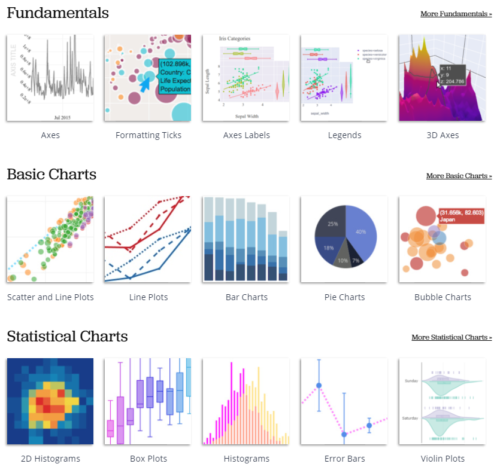
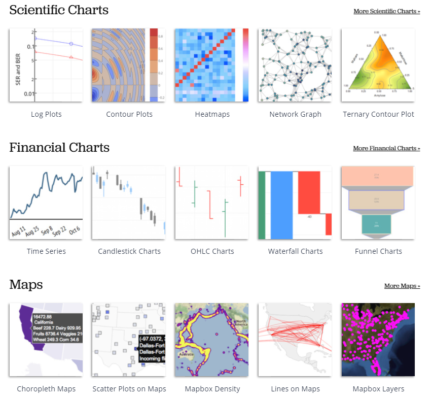
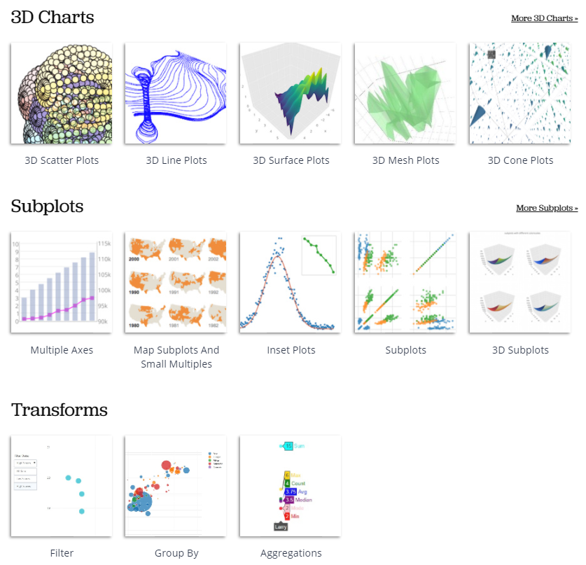
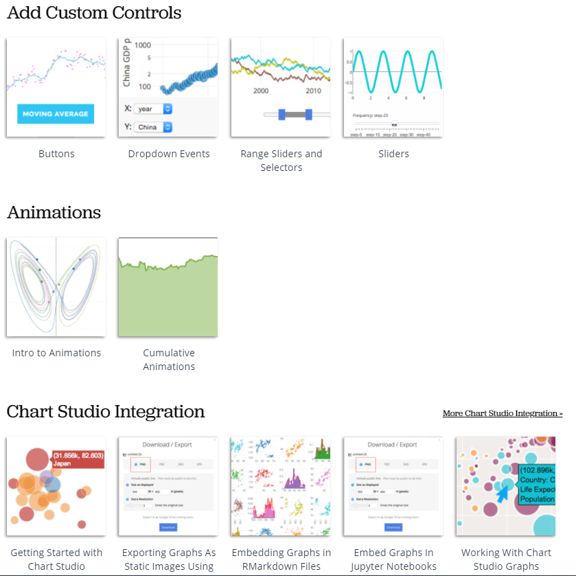
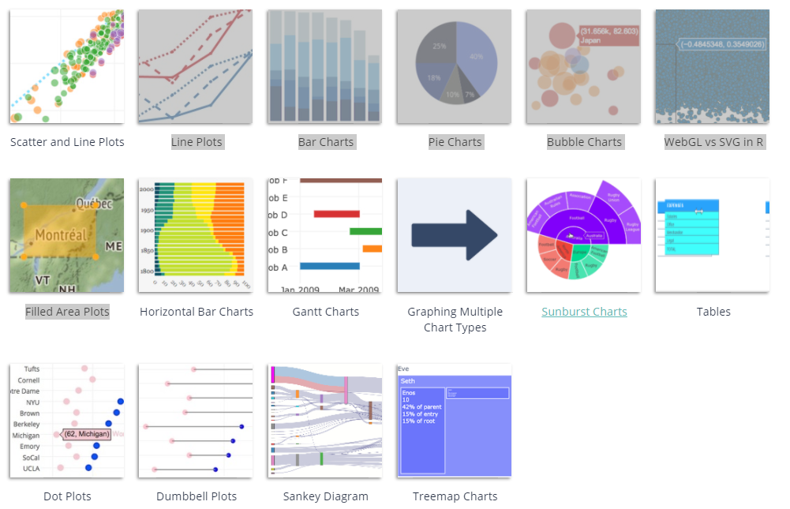

```{r setup, include=FALSE, warning=FALSE}
knitr::opts_chunk$set(echo = TRUE)

suppressWarnings(library(magrittr))
suppressWarnings(library(dplyr))
suppressWarnings(library(readxl))
suppressWarnings(library(tidyr))
suppressWarnings(library(DT))
suppressWarnings(library(kableExtra))
suppressWarnings(library(formattable))
suppressWarnings(library(knitr))
suppressWarnings(library(kableExtra))
suppressWarnings(library(rpivotTable))
suppressWarnings(library(gt))
suppressWarnings(library(reactable))
suppressWarnings(library(flextable))
suppressWarnings(library(lattice))
suppressWarnings(library(ggplot2))
suppressWarnings(library(hrbrthemes))
library(viridis)


setwd("C:/Users/oscar/Desktop/R --- SAF/Tema 5")

data <- read_excel("data.xlsx")
```


<style>
table {
background-color:#FFFFFF;
}
</style>

<style>
.list-group-item.active, .list-group-item.active:focus, .list-group-item.active:hover {
    background-color: darkblue;
}
</style>

<button onclick="document.body.scrollTop = document.documentElement.scrollTop = 0;" style="
    position: fixed;
    bottom: 5px;
    right: 40px;
    text-align: center;
    cursor: pointer;
    outline: none;
    color: #fff;
    background-color: #0A71A0;
    border: none;
    border-radius: 15px;
    
">Ir arriba</button>

# {.tabset .tabset-fade .tabset-pills}

El presente tema expone la representación visual mediantes gráficos, nube de palabras y otros elementos. Se abordarán los puntos:

- ¿Cuál método visual utilizar?
- Visualización clásica.
- ggplot.
- Plotly.
- sunburstR
- highcharter
- Otras librerías en R....

Al finalizar la sesión podrá conocer los principales **paquetes** - *librerías* de visualización de la información en R.


## Formas de visualizar {.tabset .tabset-fade .tabset-pills}


Existen muchas, muchíiiiiiiisimas formas para visualizar la información. ¿Qué deberíamos elegir? Esto depende de lo que queramos hacer.

- Barras verticales / horizontales.
- Histogramas.
- Lineas.
- Áreas.
- Disperción.
- Circular.
- Anillos o donas.
- Proyección solar.
- Bloques.
- Radar.
- Mapas.
- Nube de palabras.
- etc...

Y la lista podría seguir...

Al analizar datos nos hacemos la pregunta: ¿qué debería utlizar para visualr esta información?

Acá les presento una guía resumida:

 

¿Y para visual el texto que utilizamos?

Trataremos de cubrir esta pregunta más adelante, sin embargo adentarse en el mundo de la visualización es descubrir que existe una gama mucho más amplia, versatil e interesante a la hora de visualizar nuestra data. 


##  Clásico. {.tabset .tabset-fade .tabset-pills}


## lattice {.tabset .tabset-fade .tabset-pills}


## ggplot2 {.tabset .tabset-fade .tabset-pills}


## ggchart {.tabset .tabset-fade .tabset-pills}

 


## Plotly {.tabset .tabset-fade .tabset-pills}


La biblioteca de gráficos *R* de **Plotly** crea gráficos interactivos con calidad de publicación.

Ejemplos de cómo hacer gráficos de líneas, gráficos de dispersión, gráficos de áreas, gráficos de barras, barras de error, gráficos de caja, histogramas, mapas de calor, subtramas, gráficos de ejes múltiples y gráficos 3D.

Las principales opciones disponibles en el Plotly son :   

- https://plotly.com/r/







Pero empecemos por los gráficos *básicos*: 

- https://plotly.com/r/basic-charts/



### Lineas 

```{r warning=FALSE}
library(plotly)

x <- c(1:100)
random_y <- rnorm(100, mean = 0)
data <- data.frame(x, random_y)

fig <- plot_ly(data, x = ~x, y = ~random_y, type = 'scatter', mode = 'lines')

fig
```

```{r}
month <- c('January', 'February', 'March', 'April', 'May', 'June', 'July',
         'August', 'September', 'October', 'November', 'December')
high_2000 <- c(32.5, 37.6, 49.9, 53.0, 69.1, 75.4, 76.5, 76.6, 70.7, 60.6, 45.1, 29.3)
low_2000 <- c(13.8, 22.3, 32.5, 37.2, 49.9, 56.1, 57.7, 58.3, 51.2, 42.8, 31.6, 15.9)
high_2007 <- c(36.5, 26.6, 43.6, 52.3, 71.5, 81.4, 80.5, 82.2, 76.0, 67.3, 46.1, 35.0)
low_2007 <- c(23.6, 14.0, 27.0, 36.8, 47.6, 57.7, 58.9, 61.2, 53.3, 48.5, 31.0, 23.6)
high_2014 <- c(28.8, 28.5, 37.0, 56.8, 69.7, 79.7, 78.5, 77.8, 74.1, 62.6, 45.3, 39.9)
low_2014 <- c(12.7, 14.3, 18.6, 35.5, 49.9, 58.0, 60.0, 58.6, 51.7, 45.2, 32.2, 29.1)

data <- data.frame(month, high_2000, low_2000, high_2007, low_2007, high_2014, low_2014)

#The default order will be alphabetized unless specified as below:
data$month <- factor(data$month, levels = data[["month"]])

fig <- plot_ly(data, x = ~month, y = ~high_2014, name = 'High 2014', type = 'scatter', mode = 'lines',
        line = list(color = 'rgb(205, 12, 24)', width = 4)) 
fig <- fig %>% add_trace(y = ~low_2014, name = 'Low 2014', line = list(color = 'rgb(22, 96, 167)', width = 4)) 
fig <- fig %>% add_trace(y = ~high_2007, name = 'High 2007', line = list(color = 'rgb(205, 12, 24)', width = 4, dash = 'dash')) 
fig <- fig %>% add_trace(y = ~low_2007, name = 'Low 2007', line = list(color = 'rgb(22, 96, 167)', width = 4, dash = 'dash')) 
fig <- fig %>% add_trace(y = ~high_2000, name = 'High 2000', line = list(color = 'rgb(205, 12, 24)', width = 4, dash = 'dot')) 
fig <- fig %>% add_trace(y = ~low_2000, name = 'Low 2000', line = list(color = 'rgb(22, 96, 167)', width = 4, dash = 'dot')) 
fig <- fig %>% layout(title = "Average High and Low Temperatures in New York",
         xaxis = list(title = "Months"),
         yaxis = list (title = "Temperature (degrees F)"))

fig
```

### Puntos 

```{r}
library(plotly)

fig <- plot_ly(data = iris, x = ~Sepal.Length, y = ~Petal.Length, color = ~Species)

fig
```

### Barras

```{r}
library(plotly)

fig <- plot_ly(
  x = c("giraffes", "orangutans", "monkeys"),
  y = c(20, 14, 23),
  name = "SF Zoo",
  type = "bar"
)

fig
```

```{r}
Animals <- c("giraffes", "orangutans", "monkeys")
SF_Zoo <- c(20, 14, 23)
LA_Zoo <- c(12, 18, 29)
data <- data.frame(Animals, SF_Zoo, LA_Zoo)

fig <- plot_ly(data, x = ~Animals, y = ~SF_Zoo, type = 'bar', name = 'SF Zoo')
fig <- fig %>% add_trace(y = ~LA_Zoo, name = 'LA Zoo')
fig <- fig %>% layout(yaxis = list(title = 'Count'), barmode = 'group')

fig
```

```{r}

x <- c('Feature A', 'Feature B', 'Feature C', 'Feature D', 'Feature E')
y <- c(20, 14, 23, 25, 22)
data <- data.frame(x, y)

fig <- plot_ly(data, x = ~x, y = ~y, type = 'bar',
        marker = list(color = c('rgba(204,204,204,1)', 'rgba(222,45,38,0.8)',
                                'rgba(204,204,204,1)', 'rgba(204,204,204,1)',
                                'rgba(204,204,204,1)')))
fig <- fig %>% layout(title = "Least Used Features",
         xaxis = list(title = ""),
         yaxis = list(title = ""))

fig
```

### Burbujas 

```{r}

data <- read.csv("https://raw.githubusercontent.com/plotly/datasets/master/school_earnings.csv")

fig <- plot_ly(data, x = ~Women, y = ~Men, text = ~School, type = 'scatter', mode = 'markers',
        marker = list(size = ~Gap, opacity = 0.5))
fig <- fig %>% layout(title = 'Gender Gap in Earnings per University',
         xaxis = list(showgrid = FALSE),
         yaxis = list(showgrid = FALSE))

fig
```


```{r warning=FALSE}
data <- read.csv("https://raw.githubusercontent.com/plotly/datasets/master/gapminderDataFiveYear.csv")

data_2007 <- data[which(data$year == 2007),]
data_2007 <- data_2007[order(data_2007$continent, data_2007$country),]
slope <- 2.666051223553066e-05
data_2007$size <- sqrt(data_2007$pop * slope)
colors <- c('#4AC6B7', '#1972A4', '#965F8A', '#FF7070', '#C61951')

fig <- plot_ly(data_2007, x = ~gdpPercap, y = ~lifeExp, color = ~continent, size = ~size, colors = colors,
        type = 'scatter', mode = 'markers', sizes = c(min(data_2007$size), max(data_2007$size)),
        marker = list(symbol = 'circle', sizemode = 'diameter',
                      line = list(width = 2, color = '#FFFFFF')),
        text = ~paste('Country:', country, '<br>Life Expectancy:', lifeExp, '<br>GDP:', gdpPercap,
                      '<br>Pop.:', pop))
fig <- fig %>% layout(title = 'Life Expectancy v. Per Capita GDP, 2007',
         xaxis = list(title = 'GDP per capita (2000 dollars)',
                      gridcolor = 'rgb(255, 255, 255)',
                      range = c(2.003297660701705, 5.191505530708712),
                      type = 'log',
                      zerolinewidth = 1,
                      ticklen = 5,
                      gridwidth = 2),
         yaxis = list(title = 'Life Expectancy (years)',
                      gridcolor = 'rgb(255, 255, 255)',
                      range = c(36.12621671352166, 91.72921793264332),
                      zerolinewidth = 1,
                      ticklen = 5,
                      gridwith = 2),
         paper_bgcolor = 'rgb(243, 243, 243)',
         plot_bgcolor = 'rgb(243, 243, 243)')

fig
```

### Barras horizontales

```{r}
y <- c('giraffes', 'orangutans', 'monkeys')
SF_Zoo <- c(20, 14, 23)
LA_Zoo <- c(12, 18, 29)
data <- data.frame(y, SF_Zoo, LA_Zoo)

fig <- plot_ly(data, x = ~SF_Zoo, y = ~y, type = 'bar', orientation = 'h', name = 'SF Zoo',
        marker = list(color = 'rgba(246, 78, 139, 0.6)',
                      line = list(color = 'rgba(246, 78, 139, 1.0)',
                                  width = 3)))
fig <- fig %>% add_trace(x = ~LA_Zoo, name = 'LA Zoo',
            marker = list(color = 'rgba(58, 71, 80, 0.6)',
                          line = list(color = 'rgba(58, 71, 80, 1.0)',
                                      width = 3)))
fig <- fig %>% layout(barmode = 'stack',
         xaxis = list(title = ""),
         yaxis = list(title =""))

fig
```


```{r echo=FALSE}
y <- c('Japan', 'United Kingdom', 'Canada', 'Netherlands', 'United States', 'Belgium', 'Sweden', 'Switzerland')
x_saving <- c(1.3586, 2.2623000000000002, 4.9821999999999997, 6.5096999999999996,
              7.4812000000000003, 7.5133000000000001, 15.2148, 17.520499999999998)
x_net_worth <- c(93453.919999999998, 81666.570000000007, 69889.619999999995, 78381.529999999999,
                 141395.29999999999, 92969.020000000004, 66090.179999999993, 122379.3)
data <- data.frame(y, x_saving, x_net_worth)

fig1 <- plot_ly(x = ~x_saving, y = ~reorder(y, x_saving), name = 'Household savings, percentage of household disposable income',
              type = 'bar', orientation = 'h',
              marker = list(color = 'rgba(50, 171, 96, 0.6)',
                            line = list(color = 'rgba(50, 171, 96, 1.0)', width = 1))) 
fig1 <- fig1 %>% layout(yaxis = list(showgrid = FALSE, showline = FALSE, showticklabels = TRUE, domain= c(0, 0.85)),
         xaxis = list(zeroline = FALSE, showline = FALSE, showticklabels = TRUE, showgrid = TRUE)) 
fig1 <- fig1 %>% add_annotations(xref = 'x1', yref = 'y',
                  x = x_saving * 2.1 + 3,  y = y,
                  text = paste(round(x_saving, 2), '%'),
                  font = list(family = 'Arial', size = 12, color = 'rgb(50, 171, 96)'),
                  showarrow = FALSE)

fig2 <- plot_ly(x = ~x_net_worth, y = ~reorder(y, x_saving), name = 'Household net worth, Million USD/capita',
              type = 'scatter', mode = 'lines+markers',
              line = list(color = 'rgb(128, 0, 128)')) 
fig2 <- fig2 %>% layout(yaxis = list(showgrid = FALSE, showline = TRUE, showticklabels = FALSE,
                       linecolor = 'rgba(102, 102, 102, 0.8)', linewidth = 2,
                       domain = c(0, 0.85)),
         xaxis = list(zeroline = FALSE, showline = FALSE, showticklabels = TRUE, showgrid = TRUE,
                       side = 'top', dtick = 25000)) 
fig2 <- fig2 %>% add_annotations(xref = 'x2', yref = 'y',
                  x = x_net_worth, y = y,
                  text = paste(x_net_worth, 'M'),
                  font = list(family = 'Arial', size = 12, color = 'rgb(128, 0, 128)'),
                  showarrow = FALSE)

fig <- subplot(fig1, fig2) 
fig <- fig %>% layout(title = 'Household savings & net worth for eight OECD countries',
         legend = list(x = 0.029, y = 1.038,
                       font = list(size = 10)),
         margin = list(l = 100, r = 20, t = 70, b = 70),
         paper_bgcolor = 'rgb(248, 248, 255)',
         plot_bgcolor = 'rgb(248, 248, 255)')
fig <- fig %>% add_annotations(xref = 'paper', yref = 'paper',
                  x = -0.14, y = -0.15,
                  text = paste('OECD (2015), Household savings (indicator), Household net worth (indicator). doi: 10.1787/cfc6f499-en (Accessed on 05 June 2015)'),
                  font = list(family = 'Arial', size = 10, color = 'rgb(150,150,150)'),
                  showarrow = FALSE)

fig
```

### Sunburst (proyección solar)

```{r}
fig <- plot_ly(
  labels = c("Eve", "Cain", "Seth", "Enos", "Noam", "Abel", "Awan", "Enoch", "Azura"),
  parents = c("", "Eve", "Eve", "Seth", "Seth", "Eve", "Eve", "Awan", "Eve"),
  values = c(10, 14, 12, 10, 2, 6, 6, 4, 4),
  type = 'sunburst'
)

fig
```


```{r}
d <- data.frame(
    ids = c(
    "North America", "Europe", "Australia", "North America - Football", "Soccer",
    "North America - Rugby", "Europe - Football", "Rugby",
    "Europe - American Football","Australia - Football", "Association",
    "Australian Rules", "Autstralia - American Football", "Australia - Rugby",
    "Rugby League", "Rugby Union"
  ),
  labels = c(
    "North<br>America", "Europe", "Australia", "Football", "Soccer", "Rugby",
    "Football", "Rugby", "American<br>Football", "Football", "Association",
    "Australian<br>Rules", "American<br>Football", "Rugby", "Rugby<br>League",
    "Rugby<br>Union"
  ),
  parents = c(
    "", "", "", "North America", "North America", "North America", "Europe",
    "Europe", "Europe","Australia", "Australia - Football", "Australia - Football",
    "Australia - Football", "Australia - Football", "Australia - Rugby",
    "Australia - Rugby"
  ),
  stringsAsFactors = FALSE
)

fig <- plot_ly(d, ids = ~ids, labels = ~labels, parents = ~parents, type = 'sunburst')

fig
```

### Treemap

```{r}
fig <- plot_ly(
  type="treemap",
  labels=c("Eve", "Cain", "Seth", "Enos", "Noam", "Abel", "Awan", "Enoch", "Azura"),
  parents=c("", "Eve", "Eve", "Seth", "Seth", "Eve", "Eve", "Awan", "Eve")
)
fig
```


```{r}
labels = c("Eve", "Cain", "Seth", "Enos", "Noam", "Abel", "Awan", "Enoch", "Azura")
parents = c("", "Eve", "Eve", "Seth", "Seth", "Eve", "Eve", "Awan", "Eve")

fig <- plot_ly(
  type='treemap',
  labels=labels,
  parents=parents,
  values= c(10, 14, 12, 10, 2, 6, 6, 1, 4),
  textinfo="label+value+percent parent+percent entry+percent root",
  domain=list(column=0))

fig <- fig %>% add_trace(
  type='treemap',
  branchvalues="total",
  labels=labels,
  parents=parents,
  values=c(65, 14, 12, 10, 2, 6, 6, 1, 4),
  textinfo="label+value+percent parent+percent entry",
  outsidetextfont=list(size=20, color= "darkblue"),
  marker=list(line= list(width=2)),
  pathbar=list(visible= FALSE),
  domain=list(column=1))

fig <- fig %>% layout(
  grid=list(columns=2, rows=1),
  margin=list(l=0, r=0, b=0, t=0))

fig
```


### Diagrama Sankey

```{r}
fig <- plot_ly(
    type = "sankey",
    orientation = "h",

    node = list(
      label = c("A1", "A2", "B1", "B2", "C1", "C2"),
      color = c("blue", "blue", "blue", "blue", "blue", "blue"),
      pad = 15,
      thickness = 20,
      line = list(
        color = "black",
        width = 0.5
      )
    ),

    link = list(
      source = c(0,1,0,2,3,3),
      target = c(2,3,3,4,4,5),
      value =  c(8,4,2,8,4,2)
    )
  )
fig <- fig %>% layout(
    title = "Basic Sankey Diagram",
    font = list(
      size = 10
    )
)

fig
```

Un Sankey un poco más laborioso

```{r}
library(plotly)
library(rjson)

json_file <- "https://raw.githubusercontent.com/plotly/plotly.js/master/test/image/mocks/sankey_energy.json"
json_data <- fromJSON(paste(readLines(json_file), collapse=""))

fig <- plot_ly(
    type = "sankey",
    domain = list(
      x =  c(0,1),
      y =  c(0,1)
    ),
    orientation = "h",
    valueformat = ".0f",
    valuesuffix = "TWh",

    node = list(
      label = json_data$data[[1]]$node$label,
      color = json_data$data[[1]]$node$color,
      pad = 15,
      thickness = 15,
      line = list(
        color = "black",
        width = 0.5
      )
    ),

    link = list(
      source = json_data$data[[1]]$link$source,
      target = json_data$data[[1]]$link$target,
      value =  json_data$data[[1]]$link$value,
      label =  json_data$data[[1]]$link$label
    )
  ) 
fig <- fig %>% layout(
    title = "Energy forecast for 2050<br>Source: Department of Energy & Climate Change, Tom Counsell via <a href='https://bost.ocks.org/mike/sankey/'>Mike Bostock</a>",
    font = list(
      size = 10
    ),
    xaxis = list(showgrid = F, zeroline = F),
    yaxis = list(showgrid = F, zeroline = F)
)

fig
```


## dygraph {.tabset .tabset-fade .tabset-pills}


## sunburstR {.tabset .tabset-fade .tabset-pills}


## highcharter {.tabset .tabset-fade .tabset-pills}


## REF {.tabset .tabset-fade .tabset-pills}


Véase los siguientes sitios de referencia 

### lattice

https://www.statmethods.net/advgraphs/trellis.html
http://www.sthda.com/english/wiki/lattice-graphs
http://www.sthda.com/english/wiki/lattice-graphs
https://www.rdocumentation.org/packages/lattice/versions/0.20-41
https://www.dummies.com/programming/r/how-to-create-a-lattice-plot-in-r/
https://data-flair.training/blogs/r-lattice-package/
https://stat.ethz.ch/R-manual/R-devel/library/lattice/html/Lattice.html
http://www.datavis.ca/courses/RGraphics/R-Graphics3.pdf

### ggplot2

https://www.r-graph-gallery.com/ggplot2-package.html
http://r-statistics.co/ggplot2-Tutorial-With-R.html
https://ggplot2.tidyverse.org/
https://www.statmethods.net/advgraphs/ggplot2.html
https://rpubs.com/daniballari/ggplot
http://tutorials.iq.harvard.edu/R/Rgraphics/Rgraphics.html
https://www.rdocumentation.org/packages/ggplot2/versions/3.3.2
https://swcarpentry.github.io/r-novice-gapminder-es/08-plot-ggplot2/
https://datacarpentry.org/R-ecology-lesson/04-visualization-ggplot2.html


### ggchart

https://github.com/thomas-neitmann/ggcharts
https://www.rdocumentation.org/packages/ggcharts/versions/0.2.1
https://rdrr.io/cran/ggcharts/
https://tereom.github.io/tutoriales/R_intro_visualizacion.html

### Plotly

https://plotly.com/r/
https://plotly-r.com/
https://www.rdocumentation.org/packages/plotly/versions/4.9.2.1
https://www.neonscience.org/plotly
https://www.it-swarm.dev/es/r-plotly/
https://github.com/ropensci/plotly
https://rdrr.io/cran/plotly/man/ggplotly.html
https://www.htmlwidgets.org/showcase_plotly.html
https://www.r-bloggers.com/introduction-to-interactive-graphics-in-r-with-plotly/

### dygraph

https://rstudio.github.io/dygraphs/
https://www.htmlwidgets.org/showcase_dygraphs.html
https://github.com/rstudio/dygraphs
https://blog.rstudio.com/2015/04/14/interactive-time-series-with-dygraphs/
https://rdrr.io/cran/dygraphs/man/dySeries.html
https://rpubs.com/Da_As_Kumi/561455
https://bookdown.org/kochiuyu/Technical-Analysis-with-R/dygraphs-package.html
http://www.imsbio.co.jp/RGM/R_function_list?package=dygraphs&init=true
https://www.r-bloggers.com/how-to-plot-with-dygraphs-exercises/

### sunburstR

http://rstudio-pubs-static.s3.amazonaws.com/495237_5336f47cb4df483f8f2780cd92066449.html
https://www.data-to-viz.com/graph/sunburst.html
https://github.com/timelyportfolio/sunburstR
https://www.rdocumentation.org/packages/sunburstR/versions/2.1.3/topics/sunburst
https://rdrr.io/cran/sunburstR/src/R/sunburst.R


### highcharter

https://rstudio-pubs-static.s3.amazonaws.com/320413_6ab300527e8548b1a3cbd0d4c6200fcc.html
https://www.highcharts.com/blog/tutorials/highcharts-for-r-users/
https://towardsdatascience.com/exploring-highcharts-in-r-f754143efda7
https://github.com/jbkunst/highcharter
https://www.htmlwidgets.org/showcase_highcharts.html
https://rdrr.io/cran/highcharter/man/hc_legend.html
https://rpubs.com/jbkunst/highcharter
http://uribo.github.io/rpkg_showcase/graphics/highcharter.html