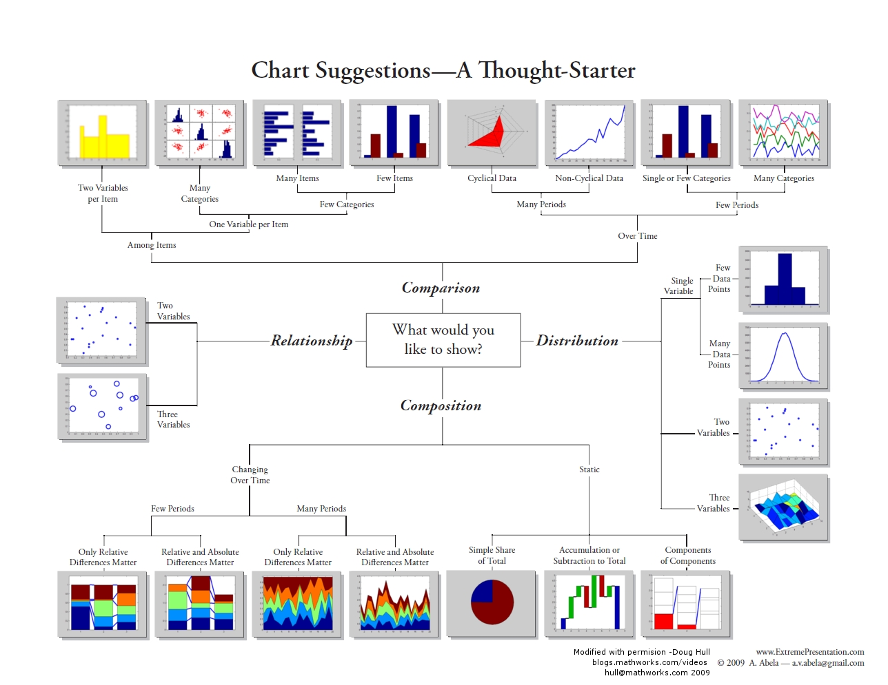

```{r setup, include=FALSE, warning=FALSE}
knitr::opts_chunk$set(echo = TRUE)

suppressWarnings(library(magrittr))
suppressWarnings(library(dplyr))
suppressWarnings(library(readxl))
suppressWarnings(library(tidyr))
suppressWarnings(library(DT))
suppressWarnings(library(kableExtra))
suppressWarnings(library(formattable))
suppressWarnings(library(knitr))
suppressWarnings(library(kableExtra))
suppressWarnings(library(rpivotTable))
suppressWarnings(library(gt))
suppressWarnings(library(reactable))
suppressWarnings(library(flextable))
suppressWarnings(library(lattice))
suppressWarnings(library(ggplot2))
suppressWarnings(library(hrbrthemes))
library(viridis)
library(highcharter)


setwd("C:/Users/oscar/Desktop/R --- SAF/Tema 5")

data <- read_excel("data.xlsx")
```


<style>
table {
background-color:#FFFFFF;
}
</style>

<style>
.list-group-item.active, .list-group-item.active:focus, .list-group-item.active:hover {
    background-color: darkblue;
}
</style>

<button onclick="document.body.scrollTop = document.documentElement.scrollTop = 0;" style="
    position: fixed;
    bottom: 5px;
    right: 40px;
    text-align: center;
    cursor: pointer;
    outline: none;
    color: #fff;
    background-color: #0A71A0;
    border: none;
    border-radius: 15px;
    
">Ir arriba</button>

# {.tabset .tabset-fade .tabset-pills}

El presente tema expone la representación visual mediantes gráficos, nube de palabras y otros elementos. Se abordarán los puntos:

- ¿Cuál método visual utilizar?
- Visualización clásica.
- ggplot.
- Plotly.
- sunburstR
- highcharter
- Otras librerías en R....

Al finalizar la sesión podrá conocer los principales **paquetes** - *librerías* de visualización de la información en R.


## Formas de visualizar {.tabset .tabset-fade .tabset-pills}


Existen muchas, muchíiiiiiiisimas formas para visualizar la información. ¿Qué deberíamos elegir? Esto depende de lo que queramos hacer.

- Barras verticales / horizontales.
- Histogramas.
- Lineas.
- Áreas.
- Disperción.
- Circular.
- Anillos o donas.
- Proyección solar.
- Bloques.
- Radar.
- Mapas.
- Nube de palabras.
- etc...

Y la lista podría seguir...

Al analizar datos nos hacemos la pregunta: ¿qué debería utlizar para visualr esta información?

Acá les presento una guía resumida:

 

¿Y para visual el texto que utilizamos?

Trataremos de cubrir esta pregunta más adelante, sin embargo adentarse en el mundo de la visualización es descubrir que existe una gama mucho más amplia, versatil e interesante a la hora de visualizar nuestra data. 


##  Clásico. {.tabset .tabset-fade .tabset-pills}


## lattice {.tabset .tabset-fade .tabset-pills}


El paquete latice fue la primera evolución en la mejora visual de los datos. Dentro de los principales gráficos se pueden realizar:


Las funciones utilizadas para poder desarrollar dichos gráficos son las siguientes:


## ggplot2 {.tabset .tabset-fade .tabset-pills}


## ggchart {.tabset .tabset-fade .tabset-pills}

 


## Plotly {.tabset .tabset-fade .tabset-pills}


## dygraph {.tabset .tabset-fade .tabset-pills}


## sunburstR {.tabset .tabset-fade .tabset-pills}


## highcharter {.tabset .tabset-fade .tabset-pills}


**Highcharter** es un librería de R para las funciones y gráficos *highcharts*. **Highcharter** es una biblioteca de visualización interactiva en JavaScript. Al igual que su predecesor (¿?), **Highcharter** presenta una potente API en lo que a la visualización de la data respecta.

Highcharter facilita la creación de gráficos dinámicos. Utiliza una sola función, *hchart ()* o *highchart()*, para dibujar gráficos para todo tipo de clases de objetos R: desde el marco de datos hasta el dendrograma. También brinda a los codificadores R una forma práctica de acceder a los otros tipos de gráficos populares de Highcharts, Highstock (para gráficos financieros) y Highmaps (para mapas esquemáticos en proyectos basados en la web), entre otros.

El paquete tiene temas fáciles de personalizar, junto con temas integrados como "economista", "tiempos financieros" y otros...

Podemos hacer tan argumentativo y flexible nuestro gráfico en highcharter a partir de sus argumentos y funciones:

https://www.rdocumentation.org/packages/highcharter/versions/0.8.2

Veamos algunos ejemplos

### Columnas

```{r warning=FALSE}
mpgman2 <- mpg %>%
  count(class, year) %>%
  glimpse()

hchart(mpgman2, "column", hcaes(x = class, y = n, group = year)) %>% hc_add_theme(hc_theme_darkunica())
```

```{r warning=FALSE}
hchart(mpgman2, "bar", hcaes(x = class, y = n, group = year))  %>% hc_add_theme(hc_theme_gridlight())
```

```{r echo=FALSE}
data("favorite_bars")
data("favorite_pies")

highchart() %>%
  # Data
  hc_add_series(favorite_pies, "column", hcaes(x = pie, y = percent), name = "Pie") %>%
  hc_add_series(favorite_bars, "pie", hcaes(name = bar, y = percent), name = "Bars") %>% 
        hc_add_theme(hc_theme_ffx()) %>%
  # Optiosn for each type of series
  hc_plotOptions(
    series = list(
      showInLegend = FALSE,
      pointFormat = "{point.y}%"
    ),
    column = list(
      colorByPoint = TRUE
    ),
    pie = list(
      colorByPoint = TRUE, center = c('30%', '10%'),
      size = 120, dataLabels = list(enabled = FALSE)
    )) %>%
  # Axis
  hc_yAxis(
    title = list(text = "percentage of tastiness"),
    labels = list(format = "{value}%"), max = 100
  ) %>%
  hc_xAxis(categories = favorite_pies$pie) %>%
  # Titles and credits
  hc_title(
    text = "This is a bar graph describing my favorite pies
    including a pie chart describing my favorite bars"
  ) %>%
  hc_subtitle(text = "In percentage of tastiness and awesomeness") %>%
  hc_credits(
    enabled = TRUE, text = "Source: HIMYM",
    style = list(fontSize = "12px")
  )
```


### Pastel

```{r warning=FALSE}
hchart(mpgman2 %>% filter(year==2008) , 
       "pie",
       hcaes(x = class, y = n)) %>% 
       hc_add_theme(hc_theme_538())
```


### Gráfico lineal

```{r warning=FALSE}
economics_long2 <- economics_long %>% 
  filter(variable %in% c("pop", "uempmed", "unemploy")) %>% 
  print()

hchart(economics_long2, "line", hcaes(x = date, y = value01, group = variable)) %>% hc_add_theme(hc_theme_google())
```


### Dispersión 

```{r warning=FALSE}
data(diamonds, mpg, package = "ggplot2")

hchart(mpg, "scatter", hcaes(x = displ, y = hwy, group = class)) %>%
  hc_title(text = "Dispersión diamonds") %>%
  hc_add_theme(hc_theme_economist())
```


### Histograma - densidad

```{r warning=FALSE}
x <- c(rnorm(10000), rnorm(1000, 4, 0.5))

hchart(x, name = "data") 
```

```{r warning=FALSE}
hchart(diamonds$price) %>% hc_add_theme(hc_theme_elementary())
```

```{r warning=FALSE}
hchart(density(diamonds$price), type = "area", color = "#B71C1C", name = "Price") %>% hc_add_theme(hc_theme_elementary())
```

### Boxplot

```{r warning=FALSE}
data(diamonds, package = "ggplot2")

hcboxplot(x = diamonds$x, var = diamonds$color,
          name = "Length", color = "#2980b9") %>%
  hc_add_theme(hc_theme_economist())
```


### Treemap

```{r warning=FALSE}
mpgman3 <- mpg %>% 
  group_by(manufacturer) %>% 
  summarise(n = n(), unique = length(unique(model))) %>% 
  arrange(-n, -unique) %>% 
  glimpse()

hchart(mpgman3, "treemap", hcaes(x = manufacturer, value = n, color = unique)) 
```

### Series de tiempo + forecastin

```{r warning=FALSE}
library(quantmod)
x <- getSymbols("USD/JPY", src = "oanda", auto.assign = FALSE)
hchart(x)
```


```{r warning=FALSE}
library("forecast")
airforecast <- forecast(auto.arima(AirPassengers), level = 95)
hchart(airforecast) %>% 
     hc_add_theme(hc_theme_sandsignika())
```

### Mapa

```{r echo=TRUE, warning=FALSE}
mapdata <- get_data_from_map(download_map_data("countries/us/us-all"))

set.seed(1234)

data_fake <- mapdata %>% 
  select(code = `hc-a2`) %>% 
  mutate(value = 1e5 * abs(rt(nrow(.), df = 10)))

```

```{r warning=FALSE}
hcmap("countries/us/us-all", data = data_fake, value = "value",
      joinBy = c("hc-a2", "code"), name = "Fake data",
      dataLabels = list(enabled = TRUE, format = '{point.name}'),
      borderColor = "#0EAD82", borderWidth = 0.1,
      tooltip = list(valueDecimals = 2, valuePrefix = "$", valueSuffix = " USD")) 
```


## REF {.tabset .tabset-fade .tabset-pills}


Véase los siguientes sitios de referencia 

### lattice

https://www.statmethods.net/advgraphs/trellis.html
http://www.sthda.com/english/wiki/lattice-graphs
http://www.sthda.com/english/wiki/lattice-graphs
https://www.rdocumentation.org/packages/lattice/versions/0.20-41
https://www.dummies.com/programming/r/how-to-create-a-lattice-plot-in-r/
https://data-flair.training/blogs/r-lattice-package/
https://stat.ethz.ch/R-manual/R-devel/library/lattice/html/Lattice.html
http://www.datavis.ca/courses/RGraphics/R-Graphics3.pdf

### ggplot2

https://www.r-graph-gallery.com/ggplot2-package.html
http://r-statistics.co/ggplot2-Tutorial-With-R.html
https://ggplot2.tidyverse.org/
https://www.statmethods.net/advgraphs/ggplot2.html
https://rpubs.com/daniballari/ggplot
http://tutorials.iq.harvard.edu/R/Rgraphics/Rgraphics.html
https://www.rdocumentation.org/packages/ggplot2/versions/3.3.2
https://swcarpentry.github.io/r-novice-gapminder-es/08-plot-ggplot2/
https://datacarpentry.org/R-ecology-lesson/04-visualization-ggplot2.html


### ggchart

https://github.com/thomas-neitmann/ggcharts
https://www.rdocumentation.org/packages/ggcharts/versions/0.2.1
https://rdrr.io/cran/ggcharts/
https://tereom.github.io/tutoriales/R_intro_visualizacion.html

### Plotly

https://plotly.com/r/
https://plotly-r.com/
https://www.rdocumentation.org/packages/plotly/versions/4.9.2.1
https://www.neonscience.org/plotly
https://www.it-swarm.dev/es/r-plotly/
https://github.com/ropensci/plotly
https://rdrr.io/cran/plotly/man/ggplotly.html
https://www.htmlwidgets.org/showcase_plotly.html
https://www.r-bloggers.com/introduction-to-interactive-graphics-in-r-with-plotly/

### dygraph

https://rstudio.github.io/dygraphs/
https://www.htmlwidgets.org/showcase_dygraphs.html
https://github.com/rstudio/dygraphs
https://blog.rstudio.com/2015/04/14/interactive-time-series-with-dygraphs/
https://rdrr.io/cran/dygraphs/man/dySeries.html
https://rpubs.com/Da_As_Kumi/561455
https://bookdown.org/kochiuyu/Technical-Analysis-with-R/dygraphs-package.html
http://www.imsbio.co.jp/RGM/R_function_list?package=dygraphs&init=true
https://www.r-bloggers.com/how-to-plot-with-dygraphs-exercises/

### sunburstR

http://rstudio-pubs-static.s3.amazonaws.com/495237_5336f47cb4df483f8f2780cd92066449.html
https://www.data-to-viz.com/graph/sunburst.html
https://github.com/timelyportfolio/sunburstR
https://www.rdocumentation.org/packages/sunburstR/versions/2.1.3/topics/sunburst
https://rdrr.io/cran/sunburstR/src/R/sunburst.R


### highcharter

https://rstudio-pubs-static.s3.amazonaws.com/320413_6ab300527e8548b1a3cbd0d4c6200fcc.html
https://www.highcharts.com/blog/tutorials/highcharts-for-r-users/
https://towardsdatascience.com/exploring-highcharts-in-r-f754143efda7
https://github.com/jbkunst/highcharter
https://www.htmlwidgets.org/showcase_highcharts.html
https://rdrr.io/cran/highcharter/man/hc_legend.html
https://rpubs.com/jbkunst/highcharter
http://uribo.github.io/rpkg_showcase/graphics/highcharter.html