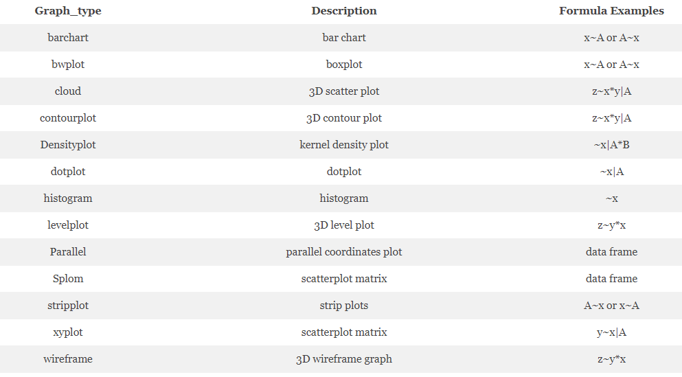
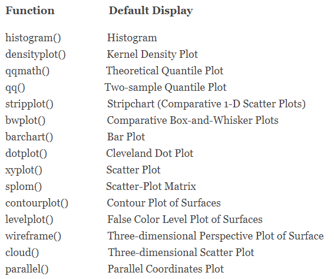
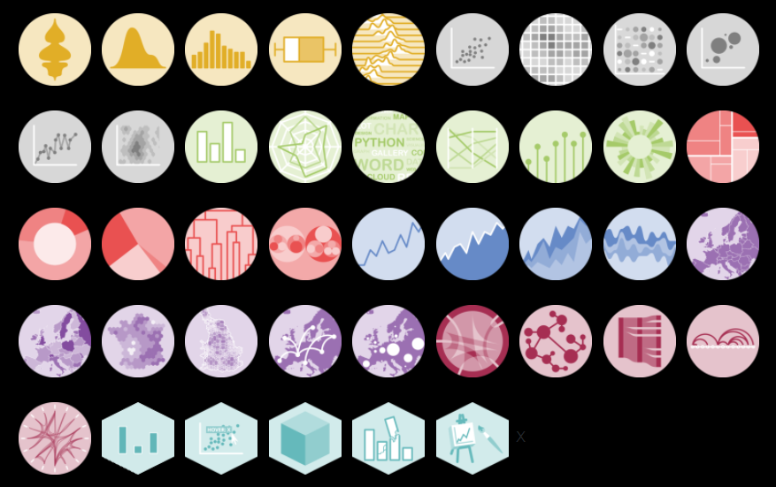
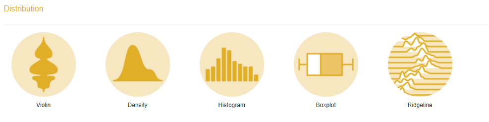
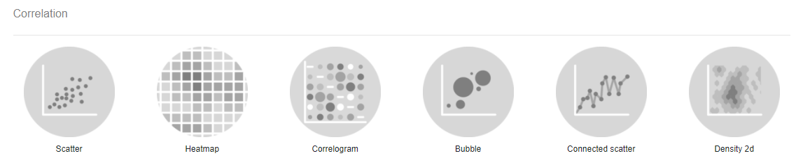
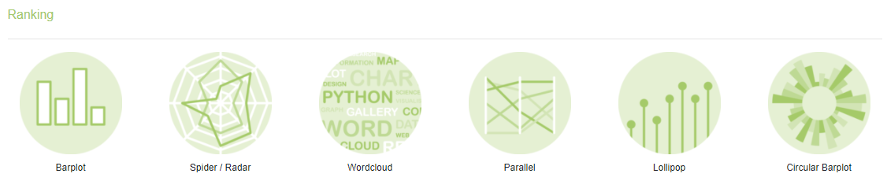
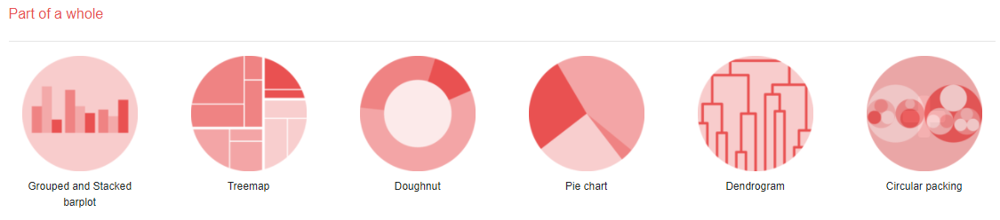
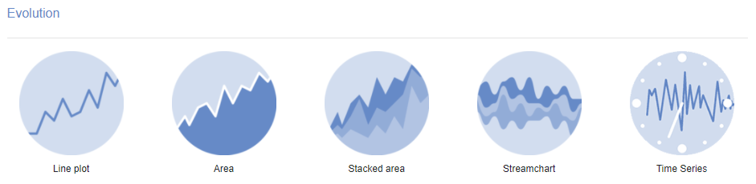
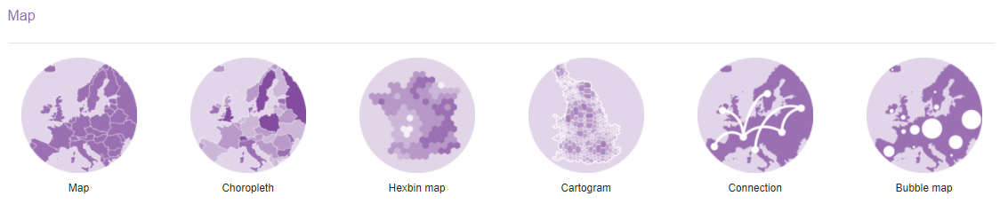
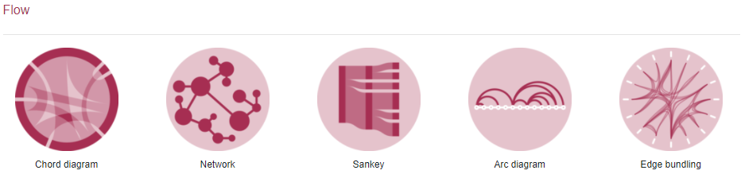

```{r setup, include=FALSE, warning=FALSE}
knitr::opts_chunk$set(echo = TRUE)

suppressWarnings(library(magrittr))
suppressWarnings(library(dplyr))
suppressWarnings(library(readxl))
suppressWarnings(library(tidyr))
suppressWarnings(library(DT))
suppressWarnings(library(kableExtra))
suppressWarnings(library(formattable))
suppressWarnings(library(knitr))
suppressWarnings(library(kableExtra))
suppressWarnings(library(rpivotTable))
suppressWarnings(library(gt))
suppressWarnings(library(reactable))
suppressWarnings(library(flextable))
suppressWarnings(library(lattice))
suppressWarnings(library(ggplot2))
suppressWarnings(library(hrbrthemes))
library(viridis)


setwd("C:/Users/oscar/Desktop/R --- SAF/Tema 4")

data <- read_excel("data.xlsx")
```


<style>
table {
background-color:#FFFFFF;
}
</style>

<style>
.list-group-item.active, .list-group-item.active:focus, .list-group-item.active:hover {
    background-color: darkblue;
}
</style>

<button onclick="document.body.scrollTop = document.documentElement.scrollTop = 0;" style="
    position: fixed;
    bottom: 5px;
    right: 40px;
    text-align: center;
    cursor: pointer;
    outline: none;
    color: #fff;
    background-color: #0A71A0;
    border: none;
    border-radius: 15px;
    
">Ir arriba</button>

# {.tabset .tabset-fade .tabset-pills}

El presente tema expone la representación visual mediantes gráficos, nube de palabras, otros elementos. Se abordarán los puntos:

- ¿Qué utilizar?.
- Visualización clásica.
- ggplot.
- Plotly.
- sunburstR
- highcharter

Al finalizar la sesión podrá conocer los principales paquetes - librerías de visualización de datos en R.

 


## Formas de visualizar {.tabset .tabset-fade .tabset-pills}


Existen muchas, muchíiiiiiiisimas formas para visualizar la información. ¿Qué deberíamos elegir? Esto depende de lo que queramos hacer.

- Barras verticales / horizontales.
- Histogramas.
- Lineas.
- Áreas.
- Disperción.
- Circular.
- Anillos o donas.
- Proyección solar.
- Bloques.
- Radar.
- Mapas.
- Nube de palabras.
- etc...

Y la lista podría seguir...

Al analizar datos nos hacemos la pregunta: ¿qué debería utlizar para visualr esta información?

Acá les presento una guía resumida:

 

¿Y para visual el texto que utilizamos?

Trataremos de cubrir esta pregunta más adelante. 


## Gráficos clásicos. {.tabset .tabset-fade .tabset-pills}


Algunos métodos clásicos de visualización de la información podrían ser:

#### Histograma


```{r warning=FALSE}
hist(iris$Sepal.Length)
```

#### Disperción

```{r warning=FALSE}
plot(iris$Sepal.Length,iris$Sepal.Width)

```

#### Un correlograma de todas las variables

```{r warning=FALSE}
plot(iris)
```

Pero, acá entre nos, ¿esos gráficos en serio les gusta?

Podríamos mostrar los gráficos "clásicos para representar la información, pero los usuarios de R han creado unas librerías expectaculares con el fin de mejorar la visualización general de los datos. 

Hagamos un recorrido por los paquetes más conocidos.

---------------------------------------------------------------------------------------------------------------------------------------------------

## lattice {.tabset .tabset-fade .tabset-pills}


El paquete latice fue la primera evolución en la mejora visual de los datos. Dentro de los principales gráficos se pueden realizar:




Las funciones utilizadas para poder desarrollar dichos gráficos son las siguientes:



Veamos algunos ejemplos


```{r echo=FALSE, warning=TRUE}
attach(mtcars)
gear.f<-factor(gear,levels=c(3,4,5),
   labels=c("3gears","4gears","5gears"))
cyl.f <-factor(cyl,levels=c(4,6,8),
   labels=c("4cyl","6cyl","8cyl"))
```

#### Gráfico de densidad

```{r warning=FALSE}

densityplot(~mpg,
   main="Density Plot",
   xlab="Miles per Gallon")
```


#### Gráfico de densidad por grupo


```{r warning=FALSE}
densityplot(~mpg|cyl.f,
   main="Density Plot by Number of Cylinders",
   xlab="Miles per Gallon")
```


#### Agrupación apilada 

```{r warning=FALSE}
densityplot(~mpg|cyl.f,
   main="Density Plot by Numer of Cylinders",
   xlab="Miles per Gallon",
   layout=c(1,3))
```

#### Disperción según factores

```{r warning=FALSE}
xyplot(mpg~wt|cyl.f*gear.f,
   main="Scatterplots by Cylinders and Gears",
   ylab="Miles per Gallon", xlab="Car Weight")
```

#### Dispersión 3D

```{r warning=FALSE}
cloud(mpg~wt*qsec|cyl.f,
   main="3D Scatterplot by Cylinders")
```

#### Correlograma de las variables

```{r warning=FALSE}
splom(mtcars[c(1,3,4,5,6)],
   main="MTCARS Data")
```

Pues, es mucho más atractivo que los gráficos "clásicos", sin embargo el ggplot trajo una mejora considerable 

---------------------------------------------------------------------------------------------------------------------------------------------------

## ggplot2 {.tabset .tabset-fade .tabset-pills}


El ggplot2 revolucionó el mundo de la visualización permitiendo explocar una gran cantidad de figuras en pos de mejorar la parte visual de los datos.

En su página web:

https://www.r-graph-gallery.com/287-smooth-animation-with-tweenr.html

Podemos encontrar 6 grandes categorias

- ggplot2 normales.
- animación.
- interactivos.
- 3D.
- los "caveats".
- "arte".

Veamos las subsecciones concernientes

### ggplot2 normales

La cantidad de gráficos y otros es bastante abundandante. En la página nos brindan una guia:


Se suele clasificar en 

- Distribución.
- Correlación.
- Ranking.
- "Part of a whole".
- Tendencia o evolución.
- Mapas.
- Flow.

Veamos algunos tipos

#### Distribución


Veamos unos cuantos:

##### Violín

```{r warning=FALSE}


# DAtos
data <- data.frame(
  name=c( rep("A",500), rep("B",500), rep("B",500), rep("C",20), rep('D', 100)  ),
  value=c( rnorm(500, 10, 5), rnorm(500, 13, 1), rnorm(500, 18, 1), rnorm(20, 25, 4), rnorm(100, 12, 1) )
)

# Most basic violin chart
p <- ggplot(data, aes(x=name, y=value, fill=name)) + 
  geom_violin()

p
```

##### Densidad doble

```{r warning=FALSE}
# Dummy data
data <- data.frame(
  var1 = rnorm(1000),
  var2 = rnorm(1000, mean=2)
)

# Chart
p <- ggplot(data, aes(x=x) ) +
  # Top
  geom_density( aes(x = var1, y = ..density..), fill="#69b3a2" ) +
  geom_label( aes(x=4.5, y=0.25, label="variable1"), color="#69b3a2") +
  # Bottom
  geom_density( aes(x = var2, y = -..density..), fill= "#404080") +
  geom_label( aes(x=4.5, y=-0.25, label="variable2"), color="#404080") +
  theme_ipsum() +
  xlab("value of x")

p

```

##### Histograma 

```{r warning=FALSE}
set.seed(1)
Ixos=rnorm(4000 , 120 , 30)     
Primadur=rnorm(4000 , 200 , 30) 
 
# First distribution
hist(Ixos, breaks=30, xlim=c(0,300), col=rgb(1,0,0,0.5), xlab="height", 
     ylab="nbr of plants" )

# Second with add=T to plot on top
hist(Primadur, breaks=30, xlim=c(0,300), col=rgb(0,0,1,0.5), add=T)

# Add legend
legend("topright", legend=c("Ixos","Primadur"), col=c(rgb(1,0,0,0.5), 
     rgb(0,0,1,0.5)), pt.cex=2, pch=15 )
```

#### Boxplot

```{r warning=FALSE}
data <- data.frame(
  name=c( rep("A",500), rep("B",500), rep("B",500), rep("C",20), rep('D', 100)  ),
  value=c( rnorm(500, 10, 5), rnorm(500, 13, 1), rnorm(500, 18, 1), rnorm(20, 25, 4), rnorm(100, 12, 1) )
)


data %>%
  ggplot( aes(x=name, y=value, fill=name)) +
    geom_boxplot() +
    scale_fill_viridis(discrete = TRUE, alpha=0.6) +
    geom_jitter(color="black", size=0.4, alpha=0.9) +
    theme_ipsum() +
    theme(
      legend.position="none",
      plot.title = element_text(size=11)
    ) +
    ggtitle("A boxplot with jitter") +
    xlab("")
```


#### Correlación


Algunos ejemplos:

#####  Disperción

```{r warning=FALSE}
x <- runif(300,  min=-10, max=10) 
y <- 0.1*x^3 - 0.5 * x^2 - x + 10 + rnorm(length(x),0,8) 
 
# plot of x and y :
plot(x,y,col=rgb(0.4,0.4,0.8,0.6),pch=16 , cex=1.3) 
 
# Can we find a polynome that fit this function ?
model <- lm(y ~ x + I(x^2) + I(x^3))
 
# I can get the features of this model :
#summary(model)
#model$coefficients
#summary(model)$adj.r.squared
 
# For each value of x, I can get the value of y estimated by the model, and add it to the current plot !
myPredict <- predict( model ) 
ix <- sort(x,index.return=T)$ix
lines(x[ix], myPredict[ix], col=2, lwd=2 )  

# I add the features of the model to the plot
coeff <- round(model$coefficients , 2)
text(3, -70 , paste("Model : ",coeff[1] , " + " , coeff[2] , "*x"  , "+" , coeff[3] , "*x^2" , "+" , coeff[4] , "*x^3" , "\n\n" , "P-value adjusted = ",round(summary(model)$adj.r.squared,2)))
```

#####  Mapa de calor

```{r warning=FALSE}
data <- as.matrix(mtcars)

heatmap(data, scale="column")

```

#####  Burbujas

```{r warning=FALSE}


# The dataset is provided in the gapminder library
library(gapminder)
data <- gapminder %>% filter(year=="2007") %>% dplyr::select(-year)

# Most basic bubble plot
data %>%
  arrange(desc(pop)) %>%
  mutate(country = factor(country, country)) %>%
  ggplot(aes(x=gdpPercap, y=lifeExp, size=pop, color=continent)) +
    geom_point(alpha=0.5) +
    scale_size(range = c(.1, 24), name="Population (M)")
```


#### Ranking


Los ejemplos

##### Radar 

```{r warning=FALSE}
library(fmsb)
 
# Create data: note in High school for several students
set.seed(99)
data <- as.data.frame(matrix( sample( 0:20 , 15 , replace=F) , ncol=5))
colnames(data) <- c("math" , "english" , "biology" , "music" , "R-coding" )
rownames(data) <- paste("mister" , letters[1:3] , sep="-")
 
# To use the fmsb package, I have to add 2 lines to the dataframe: the max and min of each variable to show on the plot!
data <- rbind(rep(20,5) , rep(0,5) , data)
 
# plot with default options:
radarchart(data)
```

##### Gráfico de coordinadas paralelas

```{r warning=FALSE}
library(hrbrthemes)
library(GGally)
library(viridis)

# Data set is provided by R natively
data <- iris

# Plot
ggparcoord(data,
    columns = 1:4, groupColumn = 5, order = "anyClass",
    showPoints = TRUE, 
    title = "Parallel Coordinate Plot for the Iris Data",
    alphaLines = 0.3
    ) + 
  scale_color_viridis(discrete=TRUE) +
  theme_ipsum()+
  theme(
    plot.title = element_text(size=10)
  )
```
##### Gráfico de barras circulares

```{r warning=FALSE}
library(tidyverse)
 
# Create dataset
data <- data.frame(
  individual=paste( "Mister ", seq(1,60), sep=""),
  group=c( rep('A', 10), rep('B', 30), rep('C', 14), rep('D', 6)) ,
  value=sample( seq(10,100), 60, replace=T)
)

data = data %>% arrange(group, value)
 
# Set a number of 'empty bar' to add at the end of each group
empty_bar <- 4
to_add <- data.frame( matrix(NA, empty_bar*nlevels(data$group), ncol(data)) )
colnames(to_add) <- colnames(data)
to_add$group <- rep(levels(data$group), each=empty_bar)
data <- rbind(data, to_add)
data <- data %>% arrange(group)
data$id <- seq(1, nrow(data))
 
# Get the name and the y position of each label
label_data <- data
number_of_bar <- nrow(label_data)
angle <- 90 - 360 * (label_data$id-0.5) /number_of_bar     # I substract 0.5 because the letter must have the angle of the center of the bars. Not extreme right(1) or extreme left (0)
label_data$hjust <- ifelse( angle < -90, 1, 0)
label_data$angle <- ifelse(angle < -90, angle+180, angle)
 
# Make the plot
p <- ggplot(data, aes(x=as.factor(id), y=value, fill=group)) +       # Note that id is a factor. If x is numeric, there is some space between the first bar
  geom_bar(stat="identity", alpha=0.5) +
  ylim(-100,120) +
  theme_minimal() +
  theme(
    legend.position = "none",
    axis.text = element_blank(),
    axis.title = element_blank(),
    panel.grid = element_blank(),
    plot.margin = unit(rep(-1,4), "cm") 
  ) +
  coord_polar() + 
  geom_text(data=label_data, aes(x=id, y=value+10, label=individual, hjust=hjust), color="black", fontface="bold",alpha=0.6, size=2.5, angle= label_data$angle, inherit.aes = FALSE ) 
 
p
```


#### "Part of a whole"



Veamos algunos ejemplos 

##### Barras verticales agrupadas

```{r warning=FALSE}
set.seed(112)
data <- matrix(sample(1:30,15) , nrow=3)
colnames(data) <- c("A","B","C","D","E")
rownames(data) <- c("var1","var2","var3")
 
# Grouped barplot
barplot(data, 
        col=colors()[c(23,89,12)] , 
        border="white", 
        font.axis=2, 
        beside=T, 
        legend=rownames(data), 
        xlab="group", 
        font.lab=2)
```

##### Treemap

```{r warning=FALSE}
# library
library(treemap)
 
# Create data
group <- c("group1","group2","group3")
value <- c(13,5,22)
data <- data.frame(group,value)
 
# treemap
treemap(data,
            index="group",
            vSize="value",
            type="index"
            )
```

##### Dendograma

```{r warning=FALSE}
data <- matrix( sample(seq(1,2000),200), ncol = 10 )
rownames(data) <- paste0("sample_" , seq(1,20))
colnames(data) <- paste0("variable",seq(1,10))

# Euclidean distance
dist <- dist(data[ , c(4:8)] , diag=TRUE)

# Hierarchical Clustering with hclust
hc <- hclust(dist)

# Plot the result
plot(hc)
```


#### Tendencia o evolución



Algunos ejemplos:


##### Área

```{r warning=FALSE}
library(ggplot2)
library(hrbrthemes)

# create data
xValue <- 1:100
yValue <- abs(cumsum(rnorm(100)))
data <- data.frame(xValue,yValue)

# Plot
ggplot(data, aes(x=xValue, y=yValue)) +
  geom_area( fill="#69b3a2", alpha=0.4) +
  geom_line(color="#69b3a2", size=2) +
  geom_point(size=3, color="#69b3a2") +
  theme_ipsum() +
  ggtitle("Evolución de algo....")
```

##### Serie temporal 

```{r warning=FALSE}
library(ggplot2)
library(dplyr)
library(hrbrthemes)

# Dummy data
data <- data.frame(
  day = as.Date("2017-06-14") - 0:364,
  value = runif(365) - seq(-140, 224)^2 / 10000
)

# Most basic bubble plot
p <- ggplot(data, aes(x=day, y=value)) +
  geom_line( color="#69b3a2") + 
  xlab("") +
  theme_ipsum() +
  theme(axis.text.x=element_text(angle=60, hjust=1)) 

p
```


#### Mapas



R es conocido y preferido sobre todo por sus mapas...

```{r warning=FALSE}
# Use the cartography library to do the choropleth map
library(cartography)

# Load data
data(nuts2006)

# Build a choropleth
choroLayer(spdf = nuts2.spdf, df = nuts2.df, var = "pop2008" , legend.pos = "right")
title("Population in 2008")
```


#### Flow



Veamos algunos ejemplos de flujos:

##### Network

```{r warning=FALSE}
library(igraph)
 
# create data:
links <- data.frame(
    source=c("A","A", "A", "A", "A","J", "B", "B", "C", "C", "D","I"),
    target=c("B","B", "C", "D", "J","A","E", "F", "G", "H", "I","I"),
    importance=(sample(1:4, 12, replace=T))
    )
nodes <- data.frame(
    name=LETTERS[1:10],
    carac=c( rep("young",3),rep("adult",2), rep("old",5))
    )
 
# Turn it into igraph object
network <- graph_from_data_frame(d=links, vertices=nodes, directed=F) 
 
# Make a palette of 3 colors
library(RColorBrewer)
coul  <- brewer.pal(3, "Set1") 
 
# Create a vector of color
my_color <- coul[as.numeric(as.factor(V(network)$carac))]
 
# Make the plot
plot(network, vertex.color=my_color)
 
# Add a legend
legend("bottomleft", legend=levels(as.factor(V(network)$carac))  , col = coul , bty = "n", pch=20 , pt.cex = 3, cex = 1.5, text.col=coul , horiz = FALSE, inset = c(0.1, 0.1))
```

##### Diagrama Sankey

```{r warning=FALSE}
library(tidyverse)
library(viridis)
library(patchwork)
library(hrbrthemes)
library(circlize)

# Load dataset from github
data <- read.table("https://raw.githubusercontent.com/holtzy/data_to_viz/master/Example_dataset/13_AdjacencyDirectedWeighted.csv", header=TRUE)
# Package
library(networkD3)

# I need a long format
data_long <- data %>%
  rownames_to_column %>%
  gather(key = 'key', value = 'value', -rowname) %>%
  filter(value > 0)
colnames(data_long) <- c("source", "target", "value")
data_long$target <- paste(data_long$target, " ", sep="")

# From these flows we need to create a node data frame: it lists every entities involved in the flow
nodes <- data.frame(name=c(as.character(data_long$source), as.character(data_long$target)) %>% unique())
 
# With networkD3, connection must be provided using id, not using real name like in the links dataframe.. So we need to reformat it.
data_long$IDsource=match(data_long$source, nodes$name)-1 
data_long$IDtarget=match(data_long$target, nodes$name)-1

# prepare colour scale
ColourScal ='d3.scaleOrdinal() .range(["#FDE725FF","#B4DE2CFF","#6DCD59FF","#35B779FF","#1F9E89FF","#26828EFF","#31688EFF","#3E4A89FF","#482878FF","#440154FF"])'

# Make the Network
sankeyNetwork(Links = data_long, Nodes = nodes,
                     Source = "IDsource", Target = "IDtarget",
                     Value = "value", NodeID = "name", 
                     sinksRight=FALSE, colourScale=ColourScal, nodeWidth=40, fontSize=13, nodePadding=20)
```

##### Diagrama chord

```{r warning=FALSE}
# devtools::install_github("mattflor/chorddiag")
library(chorddiag)

# Create dummy data
m <- matrix(c(11975,  5871, 8916, 2868,
              1951, 10048, 2060, 6171,
              8010, 16145, 8090, 8045,
              1013,   990,  940, 6907),
            byrow = TRUE,
            nrow = 4, ncol = 4)

# A vector of 4 colors for 4 groups
haircolors <- c("black", "blonde", "brown", "red")
dimnames(m) <- list(have = haircolors,
                    prefer = haircolors)
groupColors <- c("#000000", "#FFDD89", "#957244", "#F26223")

# Build the chord diagram:
p <- chorddiag(m, groupColors = groupColors, groupnamePadding = 20)
p
```

### Gráficos animados

¿Todo debe ser estático? NO!

Ver el siguiente enlace:

[Gráficos animados][website]

[website]: https://www.r-graph-gallery.com/271-ggplot2-animated-gif-chart-with-gganimate.html


### interactivos

¿Qué es un gráfico interactivo? También conocido como orientado a objetos.

Veamos un ejemplo:

```{r warning=FALSE}

library(circlepackeR)         
# devtools::install_github("jeromefroe/circlepackeR") # If needed

# Let's use the 'flare dataset' (stored in the ggraph library)
library(ggraph)
data_edge <- flare$edges
data_edge$from <- gsub(".*\\.","",data_edge$from)
data_edge$to <- gsub(".*\\.","",data_edge$to)
head(data_edge)   # This is an edge list

# We need to convert it to a nested data frame. the data.tree library is our best friend for that:
library(data.tree)
data_tree <- FromDataFrameNetwork(data_edge)
data_nested <- ToDataFrameTree(data_tree, 
                            level1 = function(x) x$path[2],
                            level2 = function(x) x$path[3],
                            level3 = function(x) x$path[4],
                            level4 = function(x) x$path[5])[-1,-1]
data_nested <- na.omit(data_nested)

# Now we can plot it as seen before!
data_nested$pathString <- paste("roots", data_nested$level1, data_nested$level2, data_nested$level3, data_nested$level4, sep = "/")
data_nested$value=1
data_Node <- as.Node(data_nested)

p <- circlepackeR(data_Node, size = "value")
p
```


Realmente, la evolución de ggplot2 se llama "Plotly" y estos suelen ser gráficos interactivos. Los veremos más adelante, pero hay otras
librerías que superan al a Plotly...


### 3D

Pues si, no puede mover de forma 3D un gráfico...

Ver el siguiente enlace:

[Gráficos 3D][website2]

[website2]: https://www.r-graph-gallery.com/3d.html

### Los denominados "arte"

Hay personas muy creativas que crean arte a partir de los gráficos.

Ver el siguiente enlace:

[Gráficos arte][website3]

[website3]: https://www.data-to-art.com/


## ggchart {.tabset .tabset-fade .tabset-pills}

 


## Plotly {.tabset .tabset-fade .tabset-pills}


## gt {.tabset .tabset-fade .tabset-pills}


## Highcharter {.tabset .tabset-fade .tabset-pills}


## REF {.tabset .tabset-fade .tabset-pills}


